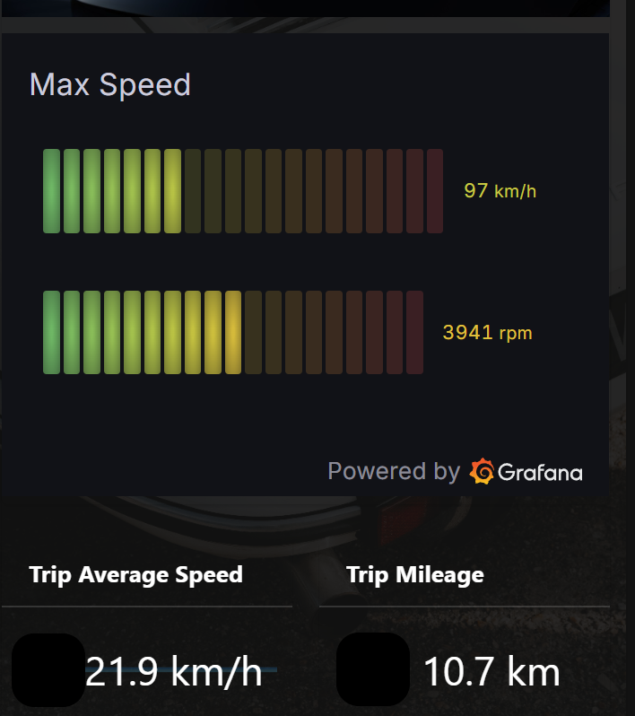

# torque2mqtt

`torque2mqtt` receives vehicle data from the Torque Android app and forwards it to an MQTT broker. Torque sends data to this service as a web endpoint; the service converts the request into a retained JSON message.

The project has been tested with Torque Pro. Torque Lite may also work, but has not been verified.



Example OpenHAB dashboard using vehicle data from MQTT.

## Features

- Publishes retained JSON messages with MQTT QoS 2.
- Supports MQTT over TLS when `mqtt.cert` points to a CA certificate file.
- Uses configurable Python logging; set the `LOGLEVEL` environment variable to change the log level.
- Tracks MQTT publish acknowledgements and attempts to reconnect when acknowledgements stop arriving.

Only JSON publishing is currently functional. The `raw` code path logs values but does not publish them to MQTT.

## How It Works

Configure Torque to use this service as its web server endpoint. The service listens for `GET /` requests and publishes the received data to:

```text
<mqtt.prefix>/<profile-name>
```

If Torque does not provide a profile name, the topic uses the profile email, then the Torque session ID. Names are converted to lowercase and spaces become underscores.

Messages are published as retained MQTT JSON. They include the Torque timestamp, available sensor values, profile information, and sensor names and units in a `meta` object. Common OBD-II fields receive readable names when Torque does not provide them. Values use the units supplied by Torque by default.

## Configuration

Create a directory containing `config.yaml`. Start with this example and update the broker details:

```yaml
server:
  ip: 0.0.0.0
  port: 5000

mqtt:
  host: 192.168.0.100
  port: 1883
  username: username
  password: password
  prefix: torque
  # Optional CA certificate file for TLS connections:
  # cert: /etc/ssl/certs/ca-certificates.crt

# Optional; converts supported distance, temperature, and speed units.
# imperial: true
```

`server.ip` and `server.port` control the HTTP listener. `mqtt.host`, `mqtt.port`, `mqtt.username`, and `mqtt.password` configure the broker connection. `mqtt.prefix` is the first part of the published topic. Set `mqtt.cert` to a CA certificate file to enable TLS. Omit the `server` section to use `0.0.0.0:5000`.

## Run From Source

Install the dependencies from `requirements.txt`, then pass the directory containing `config.yaml`:

```sh
python3 server.py --config /path/to/config-directory
```

For example, if the file is `/opt/torque2mqtt/config.yaml`, pass `/opt/torque2mqtt` as the config directory.

## Run With Docker

The published image is available as [`dlashua/torque2mqtt`](https://hub.docker.com/r/dlashua/torque2mqtt). Mount the directory containing `config.yaml` at `/config` and expose the configured HTTP port:

```sh
docker run -d \
  --name torque2mqtt \
  --restart unless-stopped \
  -p 5000:5000 \
  -v /path/to/config:/config \
  dlashua/torque2mqtt
```

### Docker Compose

```yaml
services:
  torque2mqtt:
    image: dlashua/torque2mqtt
    container_name: torque2mqtt
    restart: unless-stopped
    ports:
      - "5000:5000"
    volumes:
      - ./config:/config
```

Place `config.yaml` in the local `./config` directory before starting the service.

## Security

The HTTP endpoint has no authentication or request verification. Do not expose it directly to the public internet; restrict access to trusted devices or place it behind a secured network boundary. Use MQTT credentials and TLS where appropriate.

## Contributing

Contributions and bug reports are welcome.